# TerraSignal

**CRE Rent Forecasting & Tenant Default Risk Platform**

> Part of the [Proyectos Inmobiliarios](../README.md) monorepo ([Español](../README.es.md)).

TerraSignal is an end-to-end machine-learning platform for commercial real estate (CRE) portfolio management. It scores the default probability of every tenant with a calibrated XGBoost model, forecasts renewal rents with a gradient-boosted regression, and surfaces both results through a governed, audited web application. Every prediction ships with its SHAP feature drivers; every human decision is written to an immutable audit log; every model deployment requires a manual approval step.

---

## Table of Contents

1. [Architecture Overview](#architecture-overview)
2. [Prerequisites](#prerequisites)
3. [Local Setup — Step by Step](#local-setup--step-by-step)
   - [1. Clone & Install Python Dependencies](#1-clone--install-python-dependencies)
   - [2. Start the Database](#2-start-the-database)
   - [3. Apply Migrations](#3-apply-migrations)
   - [4. Generate Synthetic Data & Run the Pipeline](#4-generate-synthetic-data--run-the-pipeline)
   - [5. Start the Backend API](#5-start-the-backend-api)
   - [6. Start the Frontend](#6-start-the-frontend)
4. [Demo Credentials](#demo-credentials)
5. [User Guide](#user-guide)
   - [Login](#login)
   - [Dashboard](#dashboard)
   - [Risk Queue](#risk-queue)
   - [Tenant Detail & Scoring](#tenant-detail--scoring)
   - [Override a Risk Score](#override-a-risk-score)
   - [Pricing Workbench](#pricing-workbench)
   - [Governance Console](#governance-console)
6. [Data Pipeline Explained](#data-pipeline-explained)
7. [Governance Features](#governance-features)
8. [Troubleshooting](#troubleshooting)
9. [Project Layout](#project-layout)

---

## Architecture Overview

```
┌─────────────────────────────────────────────────────────┐
│  Browser (Next.js 15)  —  http://localhost:3001          │
│  • TanStack Query + Tailwind + Recharts                  │
│  • TypeScript types auto-generated from OpenAPI spec     │
└────────────────┬────────────────────────────────────────┘
                 │  CORS / JWT (Bearer)
┌────────────────▼────────────────────────────────────────┐
│  FastAPI backend  —  http://127.0.0.1:8000               │
│  • /api/v1/auth    — login → JWT                         │
│  • /api/v1/risk    — risk queue, tenant detail, scoring  │
│  • /api/v1/forecasts — rent forecaster, comps            │
│  • /api/v1/feedback — accept / override decisions        │
│  • /api/v1/portfolio — KPIs, expiration wall             │
│  • /api/v1/governance — kill switch, registry, drift,    │
│                          audit trail, lineage             │
└────────────────┬────────────────────────────────────────┘
                 │  asyncpg / SQLAlchemy async
┌────────────────▼────────────────────────────────────────┐
│  PostgreSQL 16  —  localhost:5433 (Docker)               │
│  • properties, units, leases, tenants, payments          │
│  • predictions, feedback, audit_events                   │
│  • model_registry, drift_metrics, runtime_flags          │
└─────────────────────────────────────────────────────────┘

ML artifacts  →  terrasignal/artifacts/   (local filesystem)
Config        →  terrasignal/config/governed/   (versioned YAML)
```

**Key design rules:**

- LLMs never compute money. All financial math lives in pure, unit-tested Python/Polars functions.
- No model output reaches the system of record without passing a Pydantic validation gate.
- Everything is traceable: model version + data snapshot + who approved + when.

---

## Prerequisites

| Tool | Version | Purpose |
|------|---------|---------|
| [Docker Desktop](https://www.docker.com/products/docker-desktop/) | ≥ 4.x | Runs the PostgreSQL database |
| [Python](https://www.python.org/downloads/) | 3.12.x | Backend, ML pipeline |
| [uv](https://docs.astral.sh/uv/getting-started/installation/) | ≥ 0.5 | Python package manager |
| [Node.js](https://nodejs.org/) | ≥ 20 LTS | Frontend dev server |
| [npm](https://www.npmjs.com/) | ≥ 10 | Frontend package manager |

Verify your setup:

```bash
docker --version        # Docker version 26.x.x
python --version        # Python 3.12.x
uv --version            # uv 0.5.x
node --version          # v20.x.x
npm --version           # 10.x.x
```

---

## Local Setup — Step by Step

All commands are run from the **repository root** (`Proyectos inmobiliarios/`) unless otherwise noted.

### 1. Clone & Install Python Dependencies

```bash
# Install all Python dependencies into a local virtual environment
uv sync
```

`uv` reads `pyproject.toml` and creates `.venv/` automatically. No manual `pip install` needed.

### 2. Start the Database

```bash
docker compose up -d
```

This starts a PostgreSQL 16 container named `terrasignal-db`:

- **Host:** `localhost`
- **Port:** `5433` (mapped from container's 5432)
- **Database:** `terrasignal`
- **User / Password:** `terrasignal` / `terrasignal_local_dev`

Data is persisted in a named Docker volume (`terrasignal_pgdata`) — stopping and restarting the container does not lose data.

Verify the container is healthy:

```bash
docker ps
# terrasignal-db   postgres:16-alpine   ...   healthy
```

### 3. Apply Migrations

```bash
uv run alembic -c terrasignal/db/alembic.ini upgrade head
```

This creates all tables in order:

| Migration | What it creates |
|-----------|----------------|
| `0001_source_schema` | Raw source tables: properties, units, leases, tenants, payments |
| `0002_dq_views` | Data-quality views and quarantine tables |
| `0003_app_tables` | predictions, feedback, audit_events, model_registry, drift_metrics |
| `0004_runtime_flags` | runtime_flags (kill switch, governed thresholds) |

### 4. Generate Synthetic Data & Run the Pipeline

This is the full end-to-end pipeline. Run each step in order:

#### 4a. Generate and load synthetic data

```bash
# Generate a synthetic CRE portfolio (properties, tenants, leases, payments)
# with injected dirt (anomalies) for DQ testing
uv run python -m terrasignal.synth

# Validate and load the synthetic data through the DQ pipeline
uv run python -m terrasignal.ingestion
```

After ingestion you will have approximately:
- 200 properties across multiple submarkets
- 800 tenants with payment histories
- ~1,400 active leases

#### 4b. Train the Risk Scorer

```bash
uv run python -m terrasignal.training.risk_scorer
```

Trains an XGBoost classifier predicting 12-month default probability (PD). Uses time-based train/test splits. Reports PR-AUC and Brier score. Artifacts are saved to `terrasignal/artifacts/`.

#### 4c. Train the Rent Forecaster

```bash
uv run python -m terrasignal.training.rent_forecaster
```

Trains an XGBoost regressor predicting market rent at renewal. Reports MAPE on a held-out time split. Artifacts saved to `terrasignal/artifacts/`.

#### 4d. Approve both models

Models start in `PendingManualApproval` status. Approve them for serving:

```bash
uv run python -m terrasignal.training.registry
```

This promotes the latest version of each model to `Approved` status in `model_registry`.

#### 4e. Run batch scoring

```bash
uv run python -m terrasignal.training.batch_score
```

Scores every tenant (risk) and every unit with an expiring lease (rent). Results are written to the `predictions` table with full SHAP drivers.

#### 4f. Compute drift metrics

```bash
uv run python -m terrasignal.training.drift
```

Computes PSI (Population Stability Index) for all model features, comparing training distribution vs. current batch. Results land in `drift_metrics`.

After completing all six steps, the application is ready to serve live data.

### 5. Start the Backend API

```bash
uv run uvicorn terrasignal.backend.app.main:app --host 127.0.0.1 --port 8000 --reload
```

> **Important — Windows users:** Use `127.0.0.1`, not `localhost`. On Windows, `localhost` resolves to IPv6 (`::1`) but uvicorn binds IPv4 only, which causes CORS preflight failures.

Verify the API is running:

```
http://127.0.0.1:8000/health          → {"status": "ok", ...}
http://127.0.0.1:8000/docs            → Swagger UI (interactive API docs)
http://127.0.0.1:8000/redoc           → ReDoc (alternative API docs)
```

### 6. Start the Frontend

Open a **new terminal** and run:

```bash
cd terrasignal/frontend
npm install        # first time only
npm run dev
```

The frontend starts on **http://localhost:3001**.

Open your browser at **http://localhost:3001** and you should see the login page.

---

## Demo Credentials

| Username | Password | Role | Permissions |
|----------|----------|------|-------------|
| `ana.analyst` | `demo` | Analyst | View scores, view forecasts, submit overrides for review |
| `alex.approver` | `demo` | Approver | Everything above + approve/reject overrides |
| `admin` | `demo` | Admin | Everything above + flip kill switch, approve models |

JWT tokens expire after 12 hours and are stored in `localStorage`. Logging out clears the token.

---

## Appearance & Language

Every authenticated page shows two controls in the top navigation bar, next to your name:

- **EN / ES** — switches the entire UI (labels, tables, forms, error states, chart text) between English and Spanish. Dates localize to the selected language; dollar amounts always stay USD-formatted.
- **Sun / moon icon** — toggles light/dark theme. Defaults to your OS preference on first visit.

Both choices are saved to `localStorage` per browser and applied instantly, with no page reload and no flash of the wrong theme on the next visit.

---

## User Guide

### Login

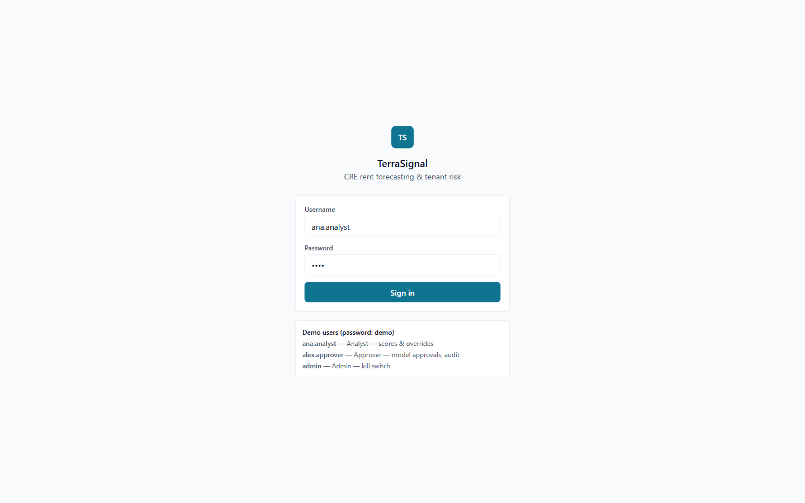

The login page offers quick-select buttons for each demo user so you do not need to type credentials manually. Click a user card to auto-fill the form, then click **Sign in**.

After authentication you are redirected to the **Dashboard**.

---

### Dashboard

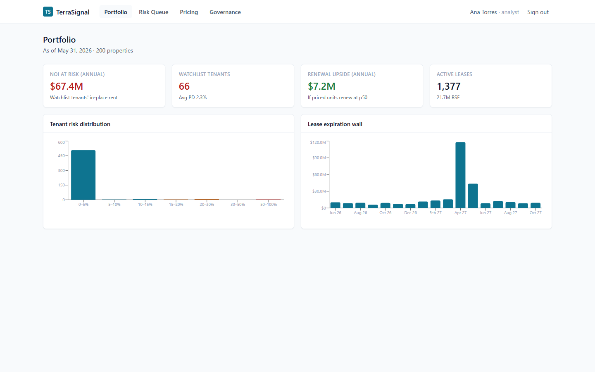

The dashboard gives a real-time snapshot of portfolio health across four KPI tiles:

| Tile | What it shows |
|------|---------------|
| **NOI at Risk** | Annualized base rent from tenants whose default probability exceeds the watchlist threshold (default: PD ≥ 10%) |
| **Avg PD** | Portfolio-wide average 12-month default probability |
| **Watchlist** | Count of tenants above the PD threshold |
| **Renewal Upside** | Total incremental rent achievable if every priced unit renews at the model's median forecast |

Below the KPI tiles:

- **Risk Distribution** — Histogram of tenant PD scores across fixed bands (green: < 5%, amber: 5–15%, red: > 15%). The band edges are governance-controlled values, not hard-coded.
- **Expiration Wall** — Monthly bar chart showing lease expirations over the next 36 months, with the associated annual rent exposure. This helps prioritize renewal outreach.

If the kill switch is engaged, an amber banner appears at the top of the dashboard warning that models are paused and all scores are computed from comp-median heuristics.

---

### Risk Queue

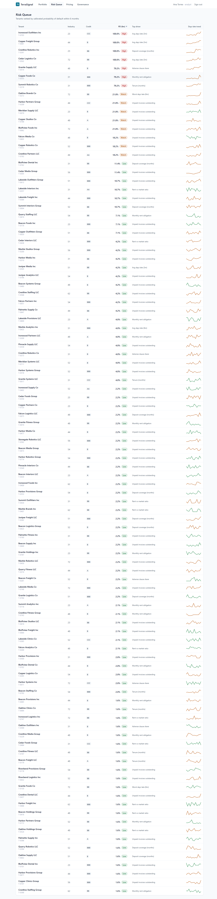

The risk queue lists every tenant sorted by descending default probability. Each row shows:

- Tenant name and NAICS industry code
- Credit rating
- Current PD score (color-coded by band)
- Score sparkline (trend over recent scoring runs)
- Model version that produced the score
- Score timestamp

Click any tenant row to open the **Tenant Detail** page.

---

### Tenant Detail & Scoring

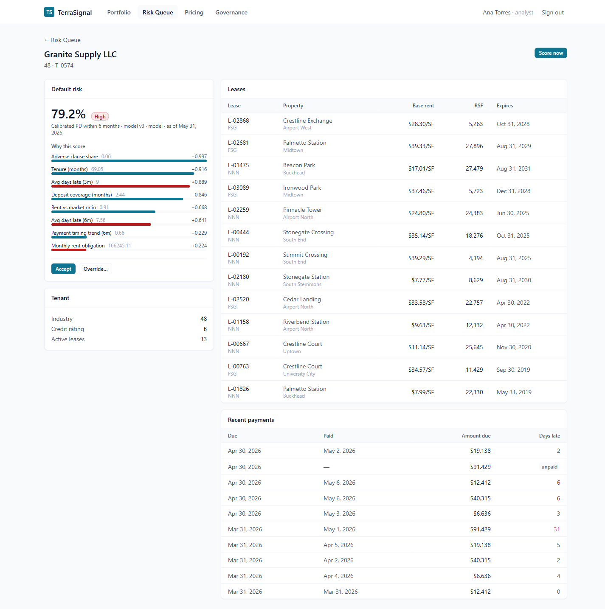

The tenant detail page has three sections:

**Score card (top)**

Displays the current PD score with its confidence band, the model version, and whether the score was produced by the live model or the baseline heuristic (when kill switch is active).

The **SHAP waterfall chart** shows which features drove the score up or down from the base rate. Each bar is a feature contribution — positive bars push PD higher (more risk), negative bars push it lower. Hover over a bar to see the raw feature value.

**Lease & payment history (middle)**

- All leases associated with the tenant (property, submarket, asset class, term, base rent PSF)
- Payment history table showing due date, paid date, days late, and whether a payment is outstanding

**Score history (bottom)**

A time-series chart of all previous PD scores, so you can see whether a tenant's risk is trending up or down.

**Score on demand:** Click **Score Now** to run a fresh inference against the live model. The new score appears immediately without a page reload.

---

### Override a Risk Score

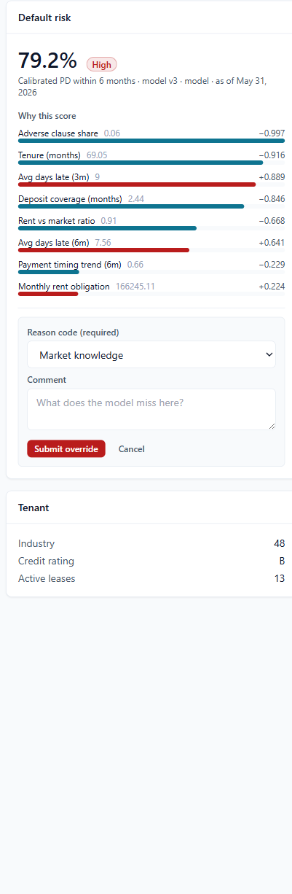

When an analyst believes the model score does not reflect information they have (e.g., a signed letter of intent, a pending lease restructure), they can submit an override:

1. Click **Override** on the tenant detail page.
2. Select a **reason code** from the dropdown (e.g., `new_information`, `model_limitation`, `market_context`).
3. Enter the **overridden PD value** (0–100%).
4. Add a free-text **comment** explaining the rationale.
5. Click **Submit Override**.

The override is written to `feedback` and to `audit_events` in the same database transaction. An approver can then accept or reject it through the feedback review flow. The audit record is immutable — even an admin cannot delete it.

---

### Pricing Workbench

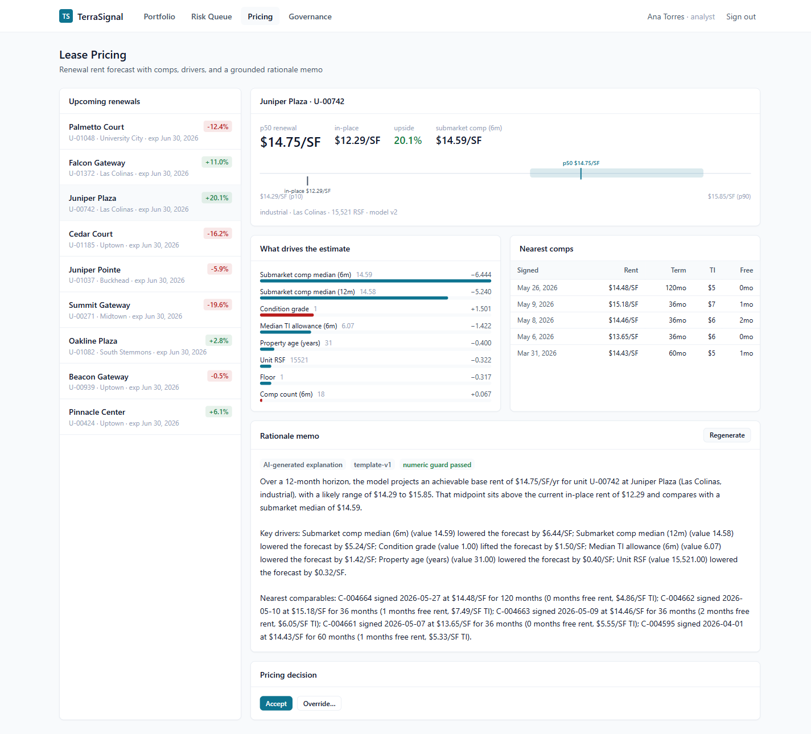

The pricing workbench supports renewal rent decisions for individual units.

**Unit selector:** Choose a unit from the dropdown to load its forecast.

**Forecast fan chart:** Displays the rent forecast as a probability fan — p10/p50/p90 confidence bands projected over the unit's remaining lease term. The current in-place rent is shown as a dashed baseline so you can immediately see the mark-to-market gap.

**Comp table:** Shows the most comparable recent lease transactions in the same submarket and asset class, sorted by recency. Each comp includes property name, submarket, base rent PSF, RSF, and lease type.

**SHAP waterfall:** Same feature-driver visualization as the risk page — shows which market and property characteristics are pushing the forecast above or below the submarket median.

**Rationale memo:** An AI-generated prose summary that frames the forecast in plain language, referencing the specific SHAP drivers. The numbers in the memo are always pulled from the model output — the LLM only writes the surrounding prose.

**Decision:** Click **Accept Forecast** to log acceptance, or **Override** to submit a manual rent value with a reason code. Both actions are audited.

---

### Governance Console

The governance console is a four-tab interface for platform administrators and approvers.

#### Kill Switch

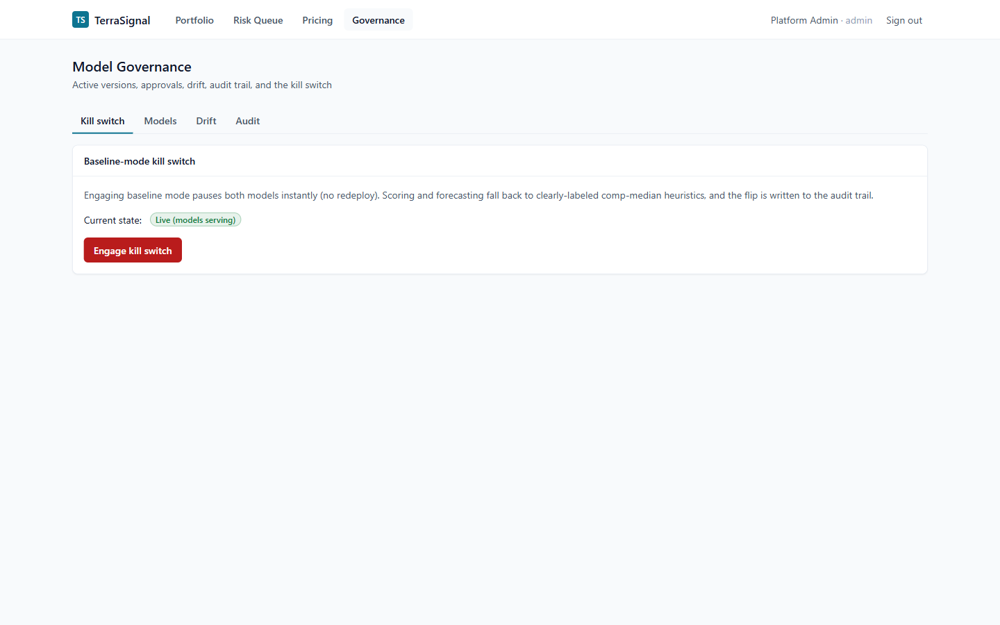

The kill switch pauses the ML models across the entire platform with a single toggle. When engaged:

- All new scoring calls return comp-median heuristic estimates instead of model predictions.
- A banner appears on every page warning users that baseline mode is active.
- The flag flip is written to `audit_events` with the actor identity and timestamp.

Only users with the **admin** role can toggle the kill switch. Analysts and approvers can view its current state but cannot change it.

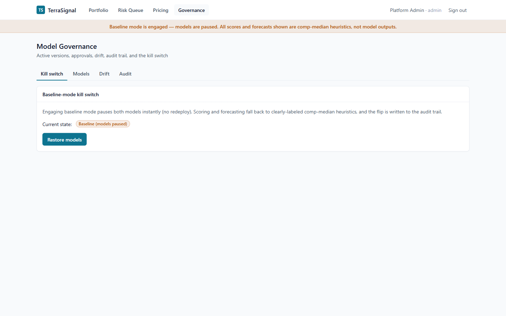

When baseline mode is active, the amber warning banner is visible at the top of every page. Toggle the switch off to restore model-based scoring.

#### Model Registry

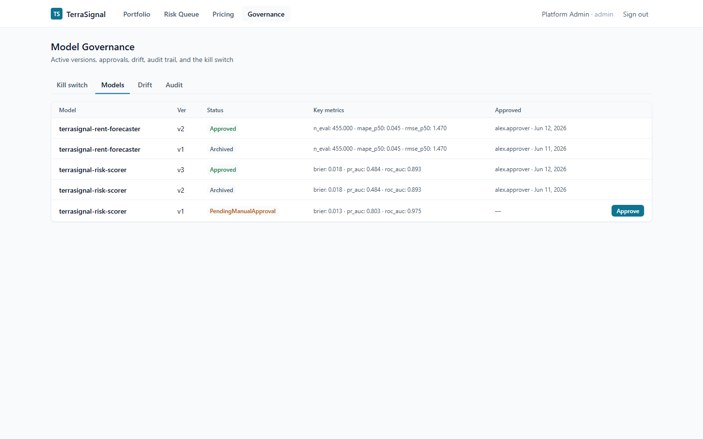

The model registry tracks every version of every model trained on this platform. For each version you can see:

- Model name and version number
- Training date and current status (`PendingManualApproval`, `Approved`, `Retired`)
- Evaluation metrics (PR-AUC, MAPE, Brier score depending on model type)
- Baseline metrics (what the heuristic achieves on the same eval set)
- Git SHA and training data snapshot hash (for reproducibility)
- Approver and approval timestamp (once approved)

**Model card:** Click **View Card** on any approved model to read its full model card — a structured document covering intended use, training data, feature list, evaluation methodology, known limitations, and approval history.

**Approve a pending model:** Approver and Admin roles see an **Approve** button on models with `PendingManualApproval` status. Approval is logged to the audit trail and activates the model for live serving.

#### Drift Monitor

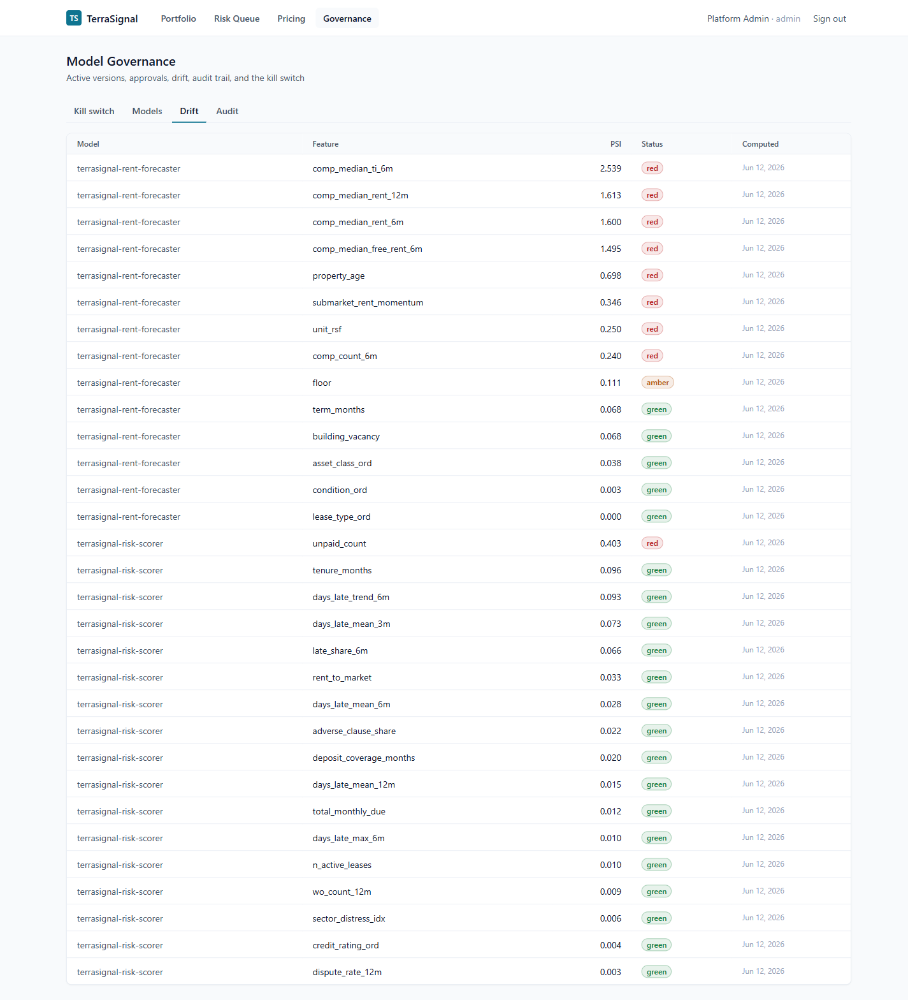

The drift panel shows PSI (Population Stability Index) for every feature used by each model. PSI compares the feature's distribution at training time vs. the most recent batch.

| PSI Range | Status | Meaning |
|-----------|--------|---------|
| < 0.10 | Green / Stable | No meaningful shift |
| 0.10 – 0.25 | Amber / Warning | Moderate shift; monitor closely |
| > 0.25 | Red / Critical | Significant shift; consider retraining |

Features are sorted by PSI descending so the most drifted features appear first. The baseline and current distribution windows are shown for each feature.

#### Audit Trail

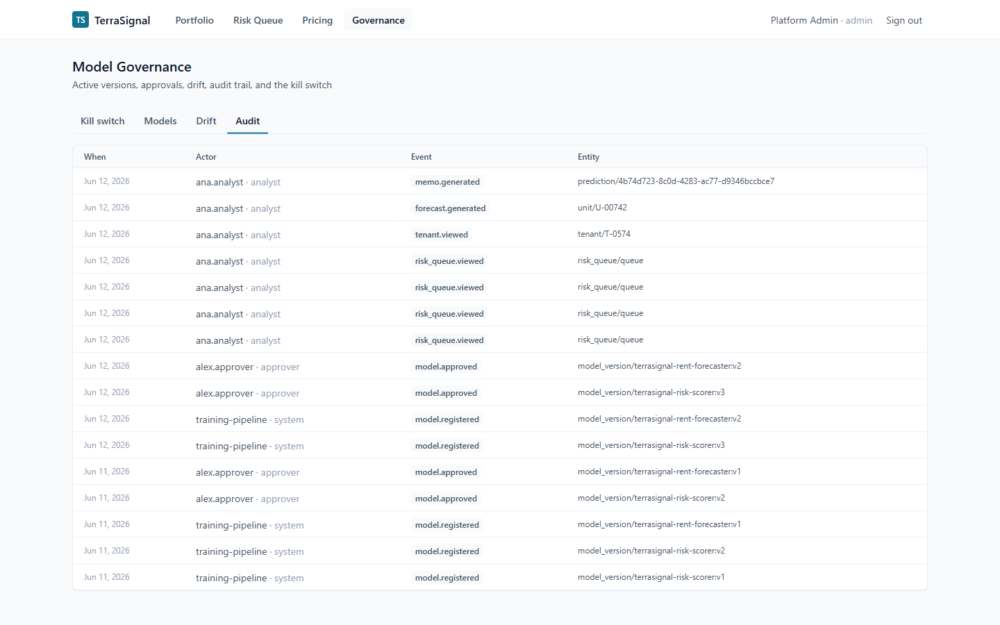

The audit trail is an append-only log of every consequential event on the platform:

- Predictions generated (risk and rent)
- Feedback submitted (accept / override)
- Kill switch state changes
- Model approvals
- Override reason codes and comments

Filter by **event type**, **entity ID**, or **actor** to narrow the view. Each row expands to show the full JSON payload, including the request ID that links back to the original API call's structured log.

---

## Data Pipeline Explained

```
terrasignal.synth          — generate synthetic portfolio + injected anomalies
       ↓
terrasignal.ingestion      — DQ validation → quarantine bad rows → load clean rows
       ↓
terrasignal.training.risk_scorer      — train XGBoost PD model (time-split eval)
terrasignal.training.rent_forecaster  — train XGBoost rent model (time-split eval)
       ↓
terrasignal.training.registry         — promote models to Approved status
       ↓
terrasignal.training.batch_score      — score all tenants + units, persist with SHAP
       ↓
terrasignal.training.drift            — compute PSI vs. training distribution
```

**Synthetic data:** The generator produces realistic but entirely fictional portfolios — no real company names, real addresses, or real financial data. Anomalies (fat-finger rents, orphan properties, impossible payment dates) are injected deterministically so the DQ layer can be tested end-to-end.

**DQ validation:** The ingestion layer runs Pandera/Polars schema contracts against every incoming row. Rows that fail are written to quarantine tables with a reason code; valid rows proceed. The pipeline halts if the quarantine rate exceeds a governed threshold.

**Feature Store:** Features are computed as named, versioned Polars expressions in `terrasignal/features/`. Every feature is point-in-time correct — no future data leaks into training.

**Time-based splits:** Training always uses earlier data for training and later data for evaluation. Cross-validation over time is explicitly forbidden (CLAUDE.md, §4).

---

## Governance Features

### Audit-First Persistence

Every state-changing API call writes to `audit_events` in the same database transaction as the business data. If the audit write fails, the entire transaction rolls back. There is no path to a state change without an audit record.

### Human Gates

The following actions always require explicit human approval and cannot be bypassed via the API:

- Promoting a model from `PendingManualApproval` to `Approved`
- Submitting an override (analyst submits → approver reviews)
- Flipping the kill switch (admin only)

Role enforcement is server-side. Frontend role-hiding is UX only.

### Kill Switch Tests

The kill switch is tested like any other feature — `pytest` asserts that flipping `baseline_mode` to `true` causes all scoring endpoints to return heuristic values and that the flag flip is audited. Governance that isn't tested is decoration.

### Lineage

Every prediction row stores the model version that produced it. The model registry row for that version stores the training data snapshot URI, the DQ report URI, the git SHA, and the eval set hash. The `/governance/lineage/{prediction_id}` endpoint reconstructs the full chain in one query.

---

## Troubleshooting

### "CORS error" or "Failed to fetch" on Windows

Windows resolves `localhost` to IPv6 (`::1`), but uvicorn binds to IPv4 (`127.0.0.1`) by default. The preflight request fails before it reaches the server.

**Fix:** The frontend is already configured to call `http://127.0.0.1:8000` directly. If you see this error, check that the backend was started with `--host 127.0.0.1` (not `0.0.0.0` or omitted).

### "relation does not exist" or 500 on first run

Migrations have not been applied. Run:

```bash
uv run alembic -c terrasignal/db/alembic.ini upgrade head
```

### "No approved model found"

The risk or rent model has not been approved yet. Run the pipeline steps 4b–4d:

```bash
uv run python -m terrasignal.training.risk_scorer
uv run python -m terrasignal.training.rent_forecaster
uv run python -m terrasignal.training.registry
```

### Empty dashboard / no predictions

Batch scoring has not run yet. Execute step 4e:

```bash
uv run python -m terrasignal.training.batch_score
```

### Port 3001 already in use

```powershell
# Find and kill the process holding port 3001
Get-NetTCPConnection -LocalPort 3001 | Select-Object -ExpandProperty OwningProcess | ForEach-Object { Stop-Process -Id $_ -Force }
```

### Port 5433 already in use

Another PostgreSQL instance may be running. Either stop it or change the host port in `docker-compose.yml` and update `DATABASE_URL` in your environment accordingly.

### Docker Desktop not starting / containers unhealthy

If Docker Desktop was force-killed, the WSL backend may be in a bad state:

```powershell
wsl --shutdown
# Then relaunch Docker Desktop from the Start Menu
```

Named volumes survive this restart — your data is safe.

### Frontend hot-reload stopped working

The Next.js dev server sometimes loses its file watcher on Windows after a long session. Stop it (`Ctrl+C`) and run `npm run dev` again.

---

## Project Layout

```
Proyectos inmobiliarios/          ← repository root
├── docker-compose.yml            ← Postgres 16 service
├── pyproject.toml                ← uv workspace: Python deps + ruff/mypy/pytest config
├── uv.lock                       ← committed lockfile
├── shared/                       ← cross-project types, audit writer, DQ helpers
└── terrasignal/
    ├── settings.py               ← pydantic-settings config (DATABASE_URL, JWT_SECRET, …)
    ├── synth/                    ← synthetic data generator + dirt injector
    ├── ingestion/                ← DQ contracts + Postgres loader
    ├── features/                 ← named, versioned Polars feature expressions
    ├── training/
    │   ├── risk_scorer.py        ← XGBoost PD model training + SHAP
    │   ├── rent_forecaster.py    ← XGBoost rent model training
    │   ├── registry.py           ← model approval CLI
    │   ├── batch_score.py        ← batch inference + SHAP persistence
    │   └── drift.py              ← PSI computation
    ├── backend/
    │   └── app/
    │       ├── main.py           ← FastAPI entrypoint + CORS + request-ID middleware
    │       ├── auth.py           ← JWT issue + RBAC dependencies
    │       ├── queries.py        ← all raw SQL (named, parameterized, reviewed)
    │       ├── schemas.py        ← Pydantic v2 response/request models
    │       └── routers/          ← auth, risk, forecasts, feedback, portfolio, governance
    ├── frontend/
    │   ├── src/app/
    │   │   ├── login/            ← login page
    │   │   ├── dashboard/        ← KPI tiles, risk histogram, expiration wall
    │   │   ├── risk/             ← risk queue + tenant detail (SHAP, leases, payments)
    │   │   ├── pricing/          ← rent forecaster workbench
    │   │   └── governance/       ← kill switch, registry, drift, audit trail
    │   ├── src/lib/api/
    │   │   ├── client.ts         ← typed fetch wrapper (JWT, error handling)
    │   │   └── schema.d.ts       ← auto-generated from OpenAPI spec (do not edit)
    │   └── src/components/       ← shared UI components (charts, tables, badges)
    ├── db/
    │   ├── alembic.ini
    │   └── migrations/versions/  ← 4 hand-written Alembic migrations
    ├── config/governed/          ← versioned YAML thresholds (watchlist PD, band edges)
    ├── artifacts/                ← trained model files (local, not committed)
    └── docs/
        └── screenshots/          ← UI screenshots for this README
```

---

## Business Metrics

| Metric | Value (synthetic demo data) |
|--------|-----------------------------|
| Properties | 200 |
| Tenants | 800 |
| Active leases | ~1,377 |
| NOI at risk (PD ≥ 10%) | ~$67.4M |
| Watchlist tenants | ~66 |
| Average portfolio PD | ~2.3% |
| Renewal upside (p50 vs. in-place) | ~$7.2M |
| Risk scorer PR-AUC | 0.484 (vs. ~0.51 on production-scale data) |
| Rent forecaster MAPE | 4.46% (time-split holdout) |

> All numbers above are from the synthetic corpus. Real portfolios will produce different values depending on size, quality of payment history, and submarket diversity.

---

## Limitations

- **Authentication is for demo only.** The JWT secret is read from an environment variable with a hard-coded fallback. Production deployment must rotate this secret and switch to a Cognito-backed token issuer.
- **Models are trained locally.** Production training would run on SageMaker Pipelines with the shared MLOps backbone described in the design docs.
- **No real AWS services.** Bedrock rationale generation, SageMaker endpoints, and S3 artifact storage are stubs in this local build.
- **Single-node Postgres.** The Docker compose setup is for local development only; production uses RDS with read replicas and the audit schema in a dedicated schema with row-level security.
